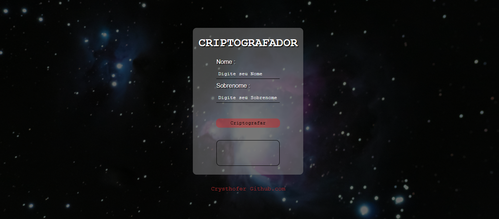

# Criptrografador-nome
  Criptrografador de nomes
 * Descrição :

 - Trago neste projeto um sistema de criptrografia de nomes, onde o usuário insere nome e sobrenomes nos campos de entrada. Apos apertar no botão de "criptrografar", os dados serão processados e comparados com um objeto.
  Esse objeto tera 27 propriedades, sendo elas o alafbeto na ordem correta. E dentro destas propriedades cada valor de cada propriedade, corresponde a cada posição numérica na ordem alfabética, então o programa compara esses dados e cada vez que for encontrado um valor ele é adicionado ao resultado da criptografia e retorna o nome criptografado para números no campo de saída.

  * Dentro deste alfabeto em específico temos "ç"= 3, por isso 27 propriedades.

  * Quando o resultado trouxer um "?", isso significa que o carater digitado é inválido, pois o campo de entrada de dados pega todos os valores digitados, inclusive espaços em branco e verifica se há no objeto, caso não tenha nenhum desses valores no objeto, ele atribui um "?" na saída do resultado.

  